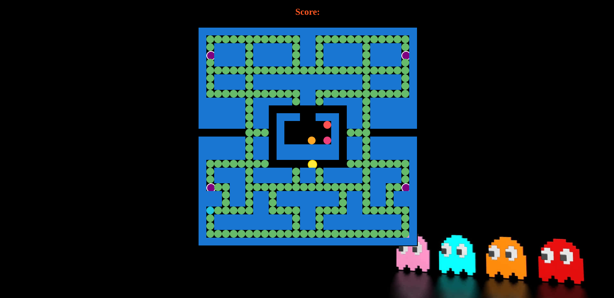

# pac-man

Pac-Man is a classic arcade game brought to life in this project developed using vanilla JavaScript, HTML, and CSS. Players control Pac-Man, a yellow circular character, navigating through a maze-like grid filled with pac-dots, power pellets, walls, and ghosts. The objective is to eat all the pac-dots while avoiding contact with the ghosts. When Pac-Man eats a power pellet, the ghosts turn blue and become vulnerable, allowing Pac-Man to eat them for extra points. The game features responsive design and dynamic visuals, capturing the nostalgic essence of the original Pac-Man game while showcasing modern web development techniques. Whether you're reliving fond memories or experiencing Pac-Man for the first time, this project promises an entertaining and engaging gaming experience.

# Pac-Man Game

### Inbuilt JavaScript functions I have used: 
* addEventListener()
* getElementById()
* querySelector()
* for Loop
* appendChild()
* createElement()
* push()
* if else statements
* classList
* switch case
* keyCode
* forEach()
* setTimeout
* Class
* constructor
* setInterval()
* removeEventListener

### MIT Licence

Copyright (c) 2024 Anouar Elissaoui

Based on the tutorial by CodeWithAnia

Original Copyright (c) 2020 Ania Kubow
